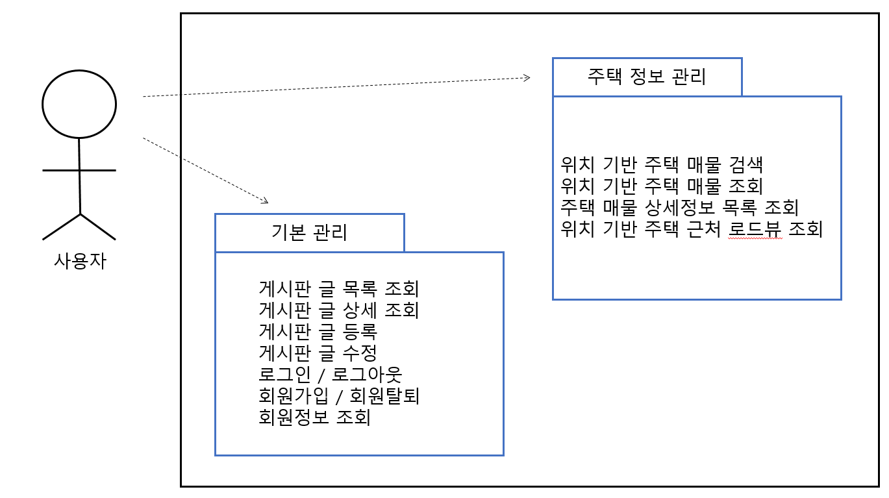
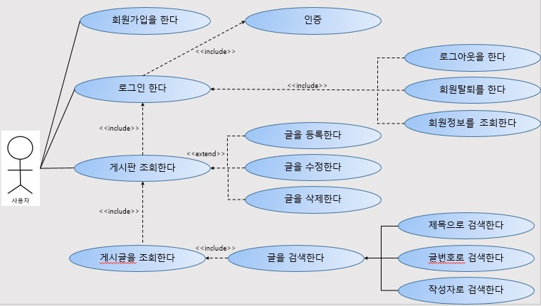
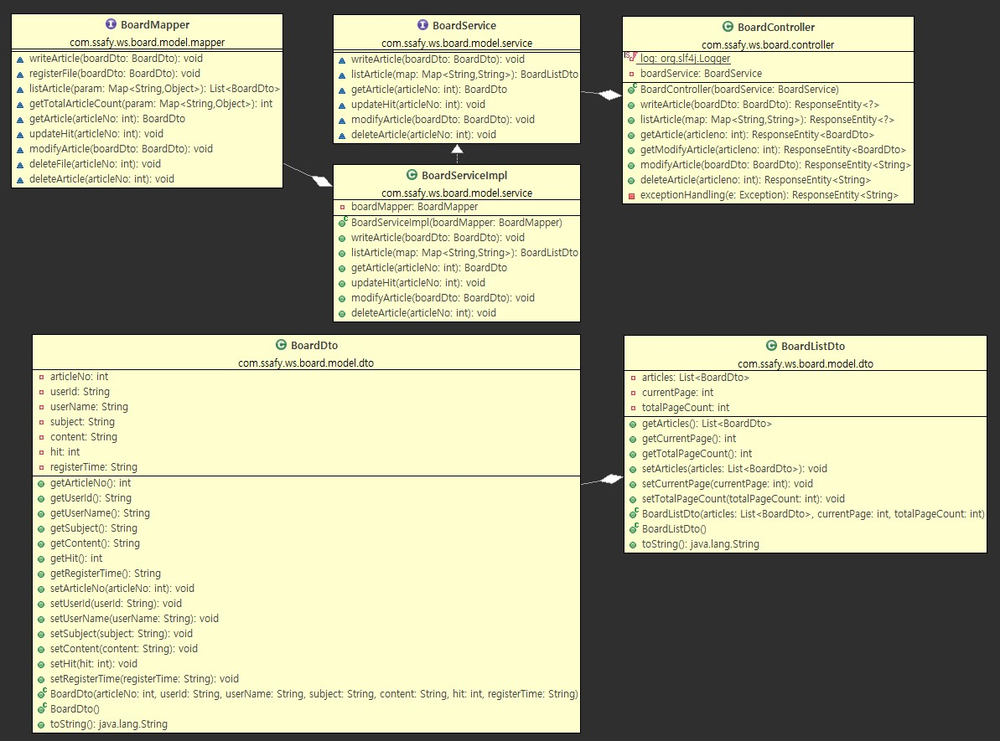
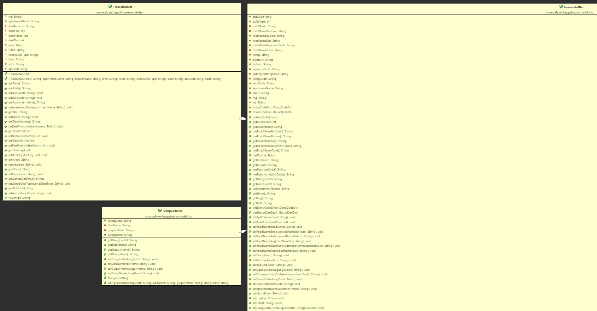

# Where-is-my-home (뭘방)
>_**SSAFY 10th 1학기 파이널 프로젝트**_

---

본 프로젝트는 MySQl을 데이터베이스로 스프링, 뷰를 통해 구현한 ```주택 실거래가 공유 사이트``` 입니다.

자유롭게 지역을 검색하고 지도에 보이는 매물들에 대한 거래 정보를 확인할 수 있으며 게시판을 통해 소통할 수 있습니다.


#### ➡️ [시연영상 보기(유튜브)](https://www.youtube.com/watch?v=W1Sgn5klIr8&t=12s)

---

<br>

## 📍 정보

| 개발기간 | '23.11.10. ~ '23.11.22. (2주)                         | 
| :---:    | :--------------------------------------------------- | 
|   플랫폼 | 웹                                                    | 
| 개발 인원| 2명                                                   |
| 담당 역할|  - (홈화면) 지역 검색 및 입력어 기반 추천 검색어 기능 구현 <br> - (매물조회 화면) 키워드로 장소를 검색하는 기능 구현 <br> - (매물조회 화면) 카카오 지도 API 활용 매물검색결과를 지도로 조회하는 기능 구현 <br> - (매물상세조회 화면) 로드뷰 제공 및 매물 정보 조회 기능 구현 <br> - (게시판) 조회/쓰기/삭제/수정 기능 구현|

|    언어 | Java(JDK1.8), HTML, CSS, JavaScript |
| :----: | :---------------------------------------------------- | 
|    서버 | Apache Tomcat 9.0 |
|프레임워크| SpringFramework(3.1.1), Vue.js, myBatis |
|    DB   | MySQL |
|API, 라이브러리| KAKAO Map API, REST API, Axios, Lombok  |

<br>

## 📍 프로젝트가 끝나고
>  프로젝트를 시작할 때는 다양한 기능을 구현하고 싶었지만 부족한 실력으로 몇 가지 기능을 구현하지 못한 점이 아쉬웠습니다. 그러나 이러한 부분에서 기초부터 다지고 연습하는 것에 대한 필요성을 느꼈고, 주먹구구식 프로그래밍이 아닌 웹의 동작 원리를 완전히 이해하고 상황에 따라 적절한 기술과 도구를 사용하는 더 나은 개발자에 대한 욕망을 품을 수 있었습니다. 미흡한 부분을 보완하여 다음 프로젝트에서는 보다 효율적이고 올바른 코드를 작성하는 데 집중하고 싶습니다. 함께 프로젝트를 진행한 조원에게 감사를 표합니다.
<br>

## 📍 1.요구사항 명세서
<details>
<summary>보기/닫기</summary>
<div markdown="1">

 |순번|	요구사항명|	요구사항 상세|
| :---: | :---------- | :--- |
|기능적 요구사항|
|F01|	주택 실거래가 검색|	국토교통부 : 실거래가 정보 활용 데이터 가공 후 DB저장|
|F02|	주택 실거래가 정보 수집|	주택 실거래가 정보를 원하는 검색 정보에 따라 검색 결과 데이터 제공|
|F03|	회원 관리|	회원정보 가입|
|F04|	로그인 관리|	로그인, 로그아웃, 로그인 권한이 있어야 주택 실거래가 정보 데이터 열람 가능|
|F05|	로드뷰 제공|	검색하는 주택 위치의 지도 로드뷰를 제공|		
|비 기능적 요구사항|
|NF1|	사용자 편의성|	웹 사이트에 대한 사전 지식이 없어도 쓰기 편해야 함|
|NF2|	응답성|	검색에 대한 결과를 빠르게 응답해야 함|
|NF3|	MSA|	REST API 적용|

</div>
</details> 

## 📍 2.Usecase Diagram
<details>
<summary>보기/닫기</summary>
<div markdown="1">
  
#### Usecase Diagram


#### Usecase Diagram, 주택 실거래가 정보 


#### Usecase Diagram, 기본 관리

</div>
</details>


## 📍 3.테이블 구조도
<details>
<summary>보기/닫기</summary>
<div markdown="1">
 


</div>
</details>

## 📍 4.클래스 다이어그램
<details>
<summary>보기/닫기</summary>
<div markdown="1">
  
#### 게시판 클래스 다이어그램



#### 주택 클래스 다이어그램


#### 회원 클래스 다이어그램


</div>
</details>

<br>

---


